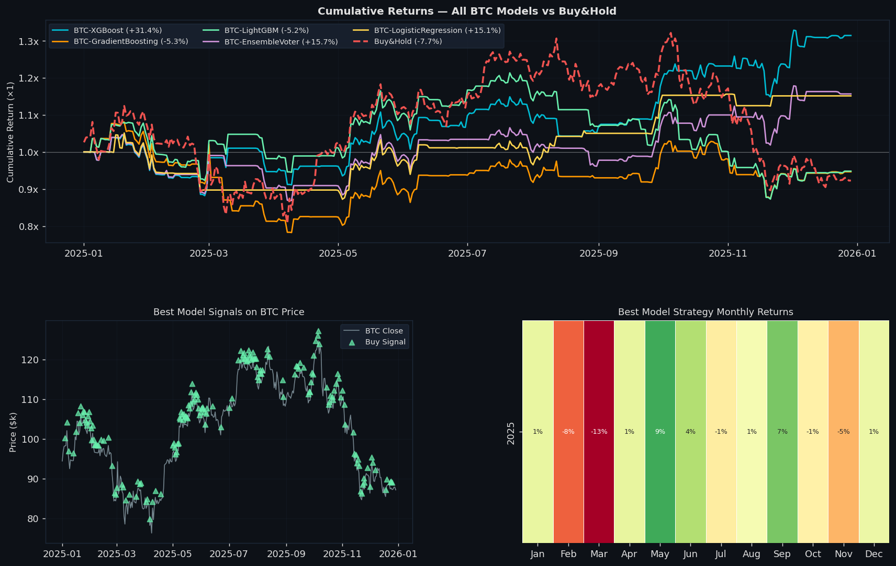
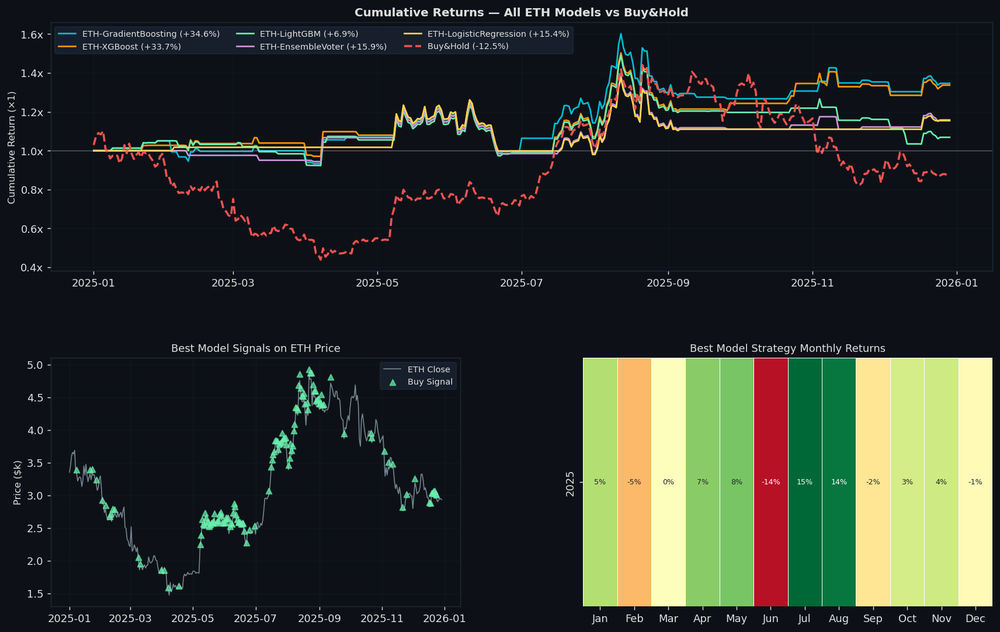

# 🚀 AlphaQuest Capital — Macro-Sentiment AI Trading Dashboard

A comprehensive, institutional-grade machine learning pipeline that predicts daily **Bitcoin (BTC)** and **Ethereum (ETH)** price movements. The system ingests macroeconomic indicators, technical analysis, and market sentiment data to dynamically size an automated $50M portfolio across a 4-state allocation protocol.

---

## 🧠 The Machine Learning Engine

The core predictive engine operates as a tournament of models. During each pipeline run, the system:
1. **Splits Data** dynamically into Training, Validation, and Test sets based on the requested window.
2. **Trains 5 Distinct Algorithms**: XGBoost, LightGBM, Random Forest, Gradient Boosting, and a tuned Logistic Regression model.
3. **Calculates Optimal Cutoffs**: Instead of using a standard 50% probability threshold, the engine evaluates the validation set to find the perfect probability cutoff that mathematically balances Precision and Recall (optimizing for the F1 score).
4. **Selects the Champion**: The pipeline automatically ranks the models by their test-set `F1 Score`. The single highest-scoring model acts as the "Signal Generator" for the actual financial backtest.

---

## 📈 The Trading Strategy: How It Works

The strategy is a Long/Cash rotational system. It generates daily predictions for tomorrow's price action based on today's closing data. There are three primary layers to the execution logic:

### 1. The Base Signal (Buy or Hold)
- **Signal = 1 (Buy):** If the Champion Model's predicted probability of a positive return tomorrow is greater than the mathematically-optimized cutoff threshold.
- **Signal = 0 (Hold Cash):** If the probability falls below the threshold. The system exits the market to protect capital.

### 2. The MA3 Trend Filter (Momentum Veto)
Machine learning models can occasionally catch "falling knives" or attempt to front-run reversals too early. To prevent this, the system uses a strict momentum overlay:
- A generated `<Buy>` signal is **only executed** if the asset's current closing price is strictly **> 1.01 * 3-Day Moving Average**.
- If the price has not convincingly broken above its fast moving average by at least 1%, the model's buy signal is vetoed, and the portfolio remains in Cash.

### 3. The Risk-Management "Kill Switch"
Designed for institutional risk constraints, the portfolio features a hard-coded Volatility Kill Switch:
- If the portfolio suffers a catastrophic drawdown of **> 5% in a single day**, the system triggers a mandatory liquidation.
- On the following day, the portfolio is forced into **100% USDT (Cash)**, overriding any AI buy signals until the volatility shock passes.

---

## 💼 4-State Portfolio Allocation

Because the pipeline evaluates BTC and ETH independently, the strategy constantly shifts across four distinct macro-regimes to optimize the $50M capital:

| Market State | BTC Signal | ETH Signal | Portfolio Allocation |
| :--- | :---: | :---: | :--- |
| **Full Bull** | 🟢 Buy | 🟢 Buy | **70% BTC / 30% ETH** |
| **Bitcoin Season** | 🟢 Buy | 🔴 Hold | **100% BTC** |
| **Altcoin Season** | 🔴 Hold | 🟢 Buy | **60% ETH / 40% USDT** (Defensive positioning) |
| **Bear Market** | 🔴 Hold | 🔴 Hold | **100% USDT** (Full Capital Preservation) |

---

## 📊 Core Feature Set

The models are trained daily on a rolling matrix of 10 composite indicators designed to capture every angle of the market:

- **Macroeconomic:** Fed Rate Cuts, 10-Yr Bond Yield Cuts, S&P 500 Daily Returns.
- **Sentiment:** Crypto Fear & Greed Index, Google Trends Momentum (3-Day vs 7-Day SMA crossover).
- **Crypto-Native Technicals:** MACD vs EMA Trend Score, RSI-14, MA-20 vs MA-200 Ratio, Volume vs 5-Day Average, and 10-Day Win Rate.

*(Note: Mathematical look-ahead bias is strictly prevented by shifting lagging indicators appropriately in the ETL pipeline).*

---

## 🛠️ Setup & Installation

### 1. Install Dependencies
Ensure you have Python 3.9+ installed.
```bash
pip install -r requirements.txt
```
*(Mac Users using XGBoost/LightGBM: you may need to run `brew install libomp` to install the OpenMP C++ runtimes).*

### 2. Get a FRED API Key (Free)
1. Sign up at [https://fred.stlouisfed.org/docs/api/api_key.html](https://fred.stlouisfed.org/docs/api/api_key.html)
2. Add it to a `.env` file or export it directly:
```bash
export FRED_API_KEY="your_api_key_here"
```

### 3. Generate the Models & Historical Data
Before starting the dashboard, you must run the pipeline engine fully to download live Yahoo Finance/FRED data, calculate the indicators, and train the AI models.
```bash
python btc_signal_pipeline.py
```

### 4. Launch the Dashboard
```bash
streamlit run app.py
```

---

## 🌐 Streamlit Cloud vs Localhost Discrepancies
If you deploy this repository to Streamlit Community Cloud, you may notice slight differences in exact metric outputs compared to running `app.py` locally. This is strictly expected behavior due to:

1. **Live Data Fetching ( `.gitignore`):** The repository does not push the `*.csv` cache files to GitHub. Therefore, the Cloud Server pulls historically dynamic real-time data from Yahoo Finance/FRED at the exact moment of its own execution, rather than relying on your local frozen CSV cache.
2. **C++ Dependencies:** High-performance libraries like XGBoost and LightGBM require underlying OS-level C++ bindings (like `libomp`) which are not typically available in lightweight Streamlit Cloud containers. The pipeline gracefully catches these missing dependencies and **automatically falls back to Gradient Boosting and Random Forest** on the Cloud dashboard, whereas your Localhost runs the full 5-model ensemble.

---

## 🖼️ Architecture Visuals
The pipeline automatically generates diagnostic graphical files on every run. 

**BTC Cumulative Run vs Buy & Hold:**


**ETH Cumulative Run vs Buy & Hold:**


---
*Disclaimer: This repository is for educational and research purposes only within institutional finance assignments. It is not intended as financial advice.*
